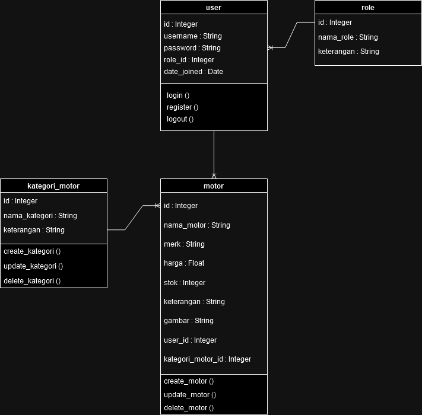

# **Aplikasi Penjualan Motor**

Aplikasi ini merupakan sistem penjualan motor yang dibangun menggunakan Django Rest Framework. Proyek ini menyediakan API untuk manajemen motor, kategori motor, dan pengguna, dan role (admin, staff, view).

---

## **Fitur**

- **Manajemen Pengguna**: CRUD pengguna dengan peran admin, staff, dan view, serta kontrol akses berdasarkan peran.
- **Manajemen Motor**: CRUD data motor dan kategorinya, khususnya untuk admin dan staff.
- **Role-Based Access Control (RBAC)**: Pengguna dibatasi aksesnya sesuai dengan peran mereka (admin, staff, view).
- **API Terstruktur**: Endpoint API yang jelas dan terstruktur untuk memudahkan integrasi dengan aplikasi lain.

---

## **Gambar ERD**

Berikut adalah diagram ERD (Entity Relationship Diagram) yang menggambarkan hubungan antar entitas dalam sistem:


Table :
- User
- Role
- Motor
- Kategori Motor

---

## **Gambar Class Diagram**

Berikut adalah diagram Class Diagram:



---

## **Requirements**

Aplikasi ini membutuhkan beberapa dependensi yang tercantum dalam `requirements.txt`. Berikut adalah cara untuk menginstal semua dependensi yang diperlukan:

1. **Aktifkan Virtual Environment**
   
   Pastikan membuat dan mengaktifkan virtual environment untuk proyek ini agar menghindari konflik dengan package lain di pada sistem anda.

   ```bash
   python -m venv myenv
   source myenv/bin/activate  # Untuk MacOS/Linux
   myenv\Scripts\activate     # Untuk Windows

2. **Install Dependencies**
   
   Setelah virtual environment diaktifkan, instal semua dependensi yang diperlukan dengan menjalankan perintah berikut:
   
   ```bash
   pip install -r requirements.txt

3. **Migrasi Database**
   
   Setelah menginstal dependensi, jalankan perintah migrasi :
   
   ```bash
   python manage.py makemigrations
   python manage.py migrate

4. **Create Superuser (Opsional)**
   
   Membuat superuser untuk login ke admin dengan perintah berikut: (Opsional)
   
   ```bash
   python manage.py createsuperuser

5. **Run Server Django**
   
   Jalankan di terminal
   
   ```bash
   python manage.py runserver

6. **Akses Aplikasi**

   Buka browser dan akses aplikasi di alamat berikut:

   ```bash
   http://127.0.0.1:8000/

---

## **User Login**

SuperUser : 
         
         Username : afifur
         password : afifur

Admin :

         username : amirullah
         password : irza
         
         username : ahmad
         password : afifur

Staff :

         username : ahmads
         password : ahmads
         
         username : irzas
         password : irzas

View :

         username : ahmadv
         password : ahmadv
         
         username : irzav
         password : irzav

---

## **Kesimpulan**

Proyek Penjualan Motor ini dibuat sebagai sistem manajemen penjualan motor yang umum digunakan dalam bisnis penjualan motor. Aplikasi ini memungkinkan pengelolaan data penjualan motor, kategori motor, dan pengguna, serta memberikan kemudahan dalam menjalankan operasional sehari-hari.

Aplikasi ini dirancang untuk membantu mempermudah transaksi dan manajemen penjualan motor, dengan alur yang sederhana dan mudah digunakan.

Jika Anda mengalami kendala atau memiliki pertanyaan lebih lanjut, jangan ragu untuk menghubungi kami melalui email di ahmadafifuridho123@gmail.com atau noblezze60@gmail.com.
   
