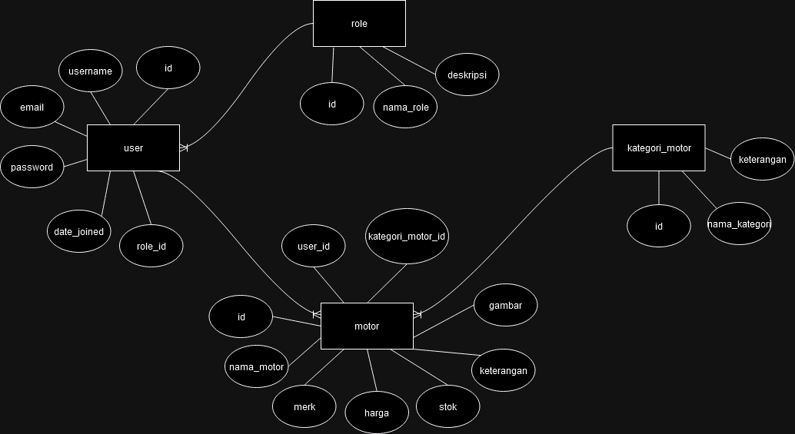

# **Aplikasi Penjualan Motor**

Aplikasi ini merupakan sistem penjualan motor yang dibangun menggunakan Django Rest Framework. Proyek ini menyediakan API untuk manajemen motor, kategori motor, dan pengguna, dengan autentikasi berbasis token JWT dan kontrol akses berbasis peran (admin, staff, user).

---

## **Fitur**

- **Autentikasi JWT**: Sistem login dengan menggunakan token JWT (SimpleJWT) untuk otentikasi pengguna.
- **Manajemen Pengguna**: CRUD pengguna dengan peran admin, staff, dan user, serta kontrol akses berdasarkan peran.
- **Manajemen Motor**: CRUD data motor dan kategorinya, khususnya untuk admin.
- **Role-Based Access Control (RBAC)**: Pengguna dibatasi aksesnya sesuai dengan peran mereka (admin, staff, user).
- **API Terstruktur**: Endpoint API yang jelas dan terstruktur untuk memudahkan integrasi dengan aplikasi lain.

---

## **Gambar ERD**

Berikut adalah diagram ERD (Entity Relationship Diagram) yang menggambarkan hubungan antar entitas dalam sistem:

---

## **Gambar Class Diagram**

Berikut adalah diagram ERD (Entity Relationship Diagram) yang menggambarkan hubungan antar entitas dalam sistem:

---

## **requirements.txt**

File `requirements.txt` berisi daftar dependencies yang dibutuhkan untuk menjalankan aplikasi ini. Berikut adalah penjelasan singkat tentang beberapa dependencies yang ada dalam file tersebut:

- **Django**: Framework untuk membangun aplikasi web dan API.
- **Django Rest Framework (DRF)**: Digunakan untuk membangun API RESTful dengan Django.
- **SimpleJWT**: Untuk autentikasi menggunakan JWT (JSON Web Token).
- **djangorestframework-simplejwt**: Sebagai ekstensi untuk menggunakan SimpleJWT di Django.
- **django-cors-headers**: Untuk menangani CORS (Cross-Origin Resource Sharing) agar API dapat diakses dari berbagai domain.

Contoh file `requirements.txt`:

